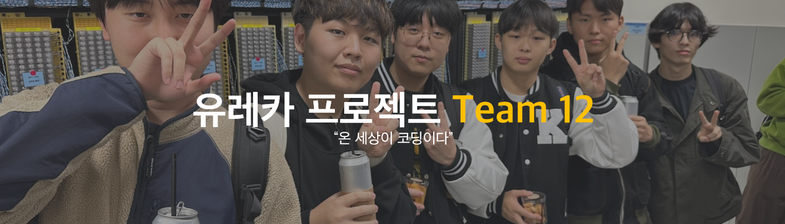

	
	<h1>⭐12조 팀 활동 최종 보고⭐</h1>
	
<strong>"온 세상이 코딩이다"</strong>

	

		팀원 : 김동훈, 김민서, 김민성, 김민재, 김태환, 신민석
	

#### 1️⃣ 진행한 팀 활동
- **주요 활동:** 교수님 및 대학원생 선배님과의 인터뷰 진행
  - **목표:** 조원 6명과 교수님과 겹치는 시간을 찾아 인터뷰를 진행
  - **도구:** [When2meet](https://www.when2meet.com/) 사용하여 시간 조율

#### 2️⃣ 팀 활동 방향
- **활동 선정 기준:** 팀 발표 활동 시 조사한 관심사를 기반으로 설정
  - **분야:** 정보보호, 게임 프로그래밍, 인공지능 등

#### 3️⃣ 성과
- **티켓 획득:** 모든 과제를 기간 내 제출, 총 28개 티켓 획득으로 빙고판 완성

#### 4️⃣ 후기 및 다짐
| 이름  | 후기       |
| :-: | -------- |
| 김동훈 | 유레카 프로젝트 힘들었지만, 팀원 전부 고생 많았습니다~ |
| 김민서 |   먼저 우리와 같은 길을 걸으신 선배님들의 조언을 들으며, 앞으로의 목표를 정할 수 있었다. 나의 인생 목표는 게임 프로그래머임은 변함이 없으나, 깊게 파기 위해선 먼저 넓게 파야한다. 라는 교수님의 조언에 따라 1,2학년 때 최대한 많은 분야들을 경험해보며 얻은 아이디어를 게임으로 적용시켜보려고 한다.       |
| 김민성 |    팀활동을 통해서 교수님, 대학원분들을 만나며 나의 개인적을 호기심을 해결할 수 있었다. 나의 인생의 목표는 솔직히 말하면 아직까지 모르겠다. 하고 싶은게 너무 많기 때문이다. 이것도 해보고 저것도 해보면서 내가 하고 싶은것을 찾아갈 생각이다. 만약 찾는다면 그게 내 인생의 목표가 되지 않을까 싶다. 남은 대학생활은 내가 하고 싶은 것을 찾기 위해 여러 활동을 하는 발판으로 삼을 생각이다. 하고 싶은 것을 찾는다면, 그게 내 목표가 된다면 팀 활동으로 알아낸 인턴쉽에 참여하고 싶다      |
| 김민재 |     팀활동을 해보며 대학원분들과 교수님, 그리고 현직에 계신 멘토님들을 만나보며 우리가 가는 진로에 방향성을 고민할때 참고할 수 있는 길이 되어주는 것 같은 느낌을 받아 좋았고 또 무었을 준비하고 어떤 방식으로 공부 해야할지 알게될 수 있어 뜻깊었다. 또 학교에 여러가지 학생에게주는 혜택들과 같은 것들을 알아보며 더욱이 학교생활을 누릴 수 있도록 해주어 좋았다,     |
| 김태환 | 유레카 프로젝트를 통하여 긴 시간동안의 팀 활동을 처음 해봤습니다. 이 활동을 계기로 팀 단위로 무언가의 활동을 진행할 때 겪을 수 있는 여러 상황에 어떻게 대처해야할 지 배울 수 있었습니다. 무엇보다 선배님들과의 인터뷰, 교수님들과의 인터뷰를 통해 소프트웨어학부 자체에 대한 이해가 깊어졌습니다. 이번 학습을 계기로 제가 무엇을 공부해야 하는 지, 어떻게 공부해야 하는 지에 대하여 윤곽을 그릴 수 있는 능력이 생겼습니다.    |
| 신민석 |   아직 구체적인 인생 목표나 관심있는 분야를 정하지 못해서 고민이었는데 확실히 무엇을 해야겠다고 마음먹기 전 까지는 최대한 다양한 분야를 경험해보는 것을 최우선의 가치로 놓아야겠다는 생각이 들었다. 남은 대학 생활 동안 알고리즘, 새로운 프로그래밍 언어 학습, 소규모 프로젝트 진행 등 여러가지 활동을 해 볼 생각이다. 활동 중 올바른 방향으로 가고 있는지 의문이 자주 들 것 같은데 그럴때마다 멘토링 활동을 통해 조언을 받으려 한다.        |

---

**Team 12 - 온 세상이 코딩이다**
